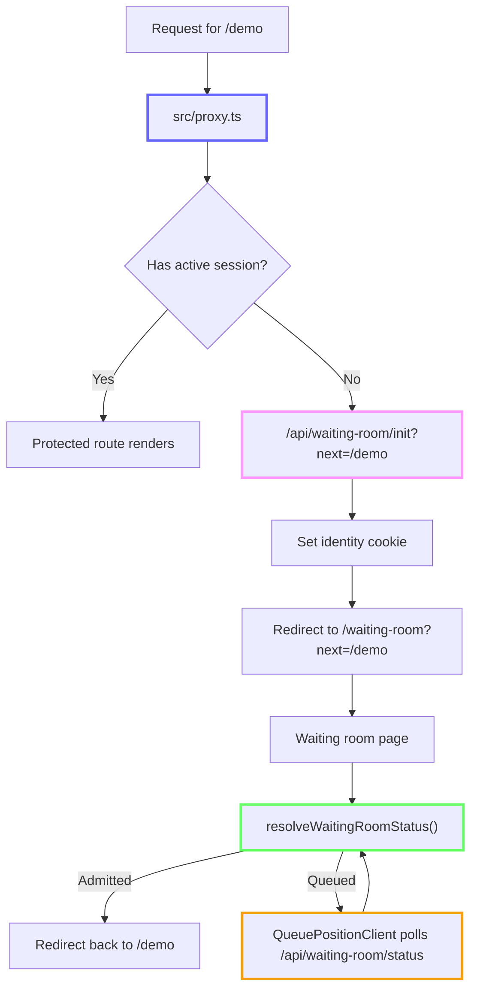

# nextjs-waiting-room

Deploy a waiting room in front of a Next.js route on Vercel. This repo shows how to intercept traffic in `proxy.ts`, admit users atomically in Redis, and preserve the original destination through the full queue flow.

[](https://vercel.com/new/clone?repository-url=https%3A%2F%2Fgithub.com%2Fvercel%2Fnextjs-waiting-room&env=WAITING_ROOM_PROVIDER,UPSTASH_REDIS_REST_URL,UPSTASH_REDIS_REST_TOKEN&envDescription=Configure%20your%20waiting%20room%20provider%20and%20Redis%20credentials&envLink=https%3A%2F%2Fgithub.com%2Fvercel%2Fnextjs-waiting-room%23configuration)

## Features

- Provider-agnostic: Upstash Redis, self-hosted Redis (ioredis), or in-memory (dev)
- FIFO queue with position tracking (Redis providers)
- Atomic admission via Lua scripts (no thundering herd)
- Rolling average wait-time estimation
- Fail-open circuit breaker (site stays up if Redis is down)
- Next.js 16 proxy.ts (replaces middleware.ts)
- Session renewal via waitUntil() (non-blocking)
- Auto-polling client (5s interval with exponential backoff)
- Namespaced Redis keys (multi-tenant safe)
- Preserves the original destination through the full queue flow

## Start Here

If you are reading this repo as a reference architecture, start with these files:

1. `src/proxy.ts` — the hot path for protected routes
2. `src/lib/waiting-room/service.ts` — the shared decision layer used by Proxy, routes, and pages
3. `src/app/api/waiting-room/init/route.ts` — the entry point that mints queue identity and redirects into the waiting room
4. `src/app/api/waiting-room/status/route.ts` — the polling endpoint that moves queued users to admitted users
5. `src/lib/waiting-room/providers/*.ts` — the provider implementations and atomic Redis admission logic
6. `src/app/waiting-room/*` — the waiting room UI and queue polling client

## Request Lifecycle



## Why The Repo Is Structured This Way

- `src/proxy.ts` stays thin. Proxy runs on every protected request, so it only reads cookies, asks the service layer for a decision, and refreshes session cookies when needed.
- `src/lib/waiting-room/service.ts` owns state transitions. Proxy, route handlers, and Server Components all reuse the same decisions instead of reimplementing queue logic in multiple places.
- `src/app/api/waiting-room/init/route.ts` is the single place that creates queue identity. That keeps the first redirect, the waiting room page, and the polling endpoint aligned on the same cookie contract.
- `src/lib/waiting-room/providers/*.ts` hide backend differences behind one provider interface. The rest of the app does not care whether the backing store is Upstash, ioredis, or the in-memory development provider.
- `src/app/waiting-room/*` is UI only. The queue policy lives in the service and provider layers, not in React components.

## Quick Start

1. Clone the repository.
2. Install dependencies:

   ```bash
   pnpm install
   ```

3. Configure environment variables:

   ```bash
   cp .env.example .env.local
   ```

4. Start the development server:

   ```bash
   pnpm dev
   ```

5. Open <http://localhost:3000>.

## Core Runtime vs Demo Files

These files are the core waiting-room architecture you would copy into another app:

- `src/proxy.ts`
- `src/lib/waiting-room/types.ts`
- `src/lib/waiting-room/config.ts`
- `src/lib/waiting-room/edge-config.ts`
- `src/lib/waiting-room/cookies.ts`
- `src/lib/waiting-room/index.ts`
- `src/lib/waiting-room/service.ts`
- `src/lib/waiting-room/providers/*.ts`
- `src/lib/waiting-room/lua/try-admit.ts`
- `src/app/api/waiting-room/init/route.ts`
- `src/app/api/waiting-room/status/route.ts`

These files exist to make the demo easier to understand locally, but they are not required for a production waiting room:

- `src/lib/waiting-room/demo-simulation.ts`
- `src/app/api/waiting-room/stats/route.ts`
- `src/app/live-mode-panel.tsx`
- `src/app/demo-traffic-controls.tsx`
- `src/app/demo-mode-tabs.tsx`
- `src/app/(protected)/demo/page.tsx`
- `src/app/(protected)/purchase-button.tsx`
- `src/app/(protected)/session-footer.tsx`

## Configuration

### Environment Variables

| Variable | Description | Default |
| :--- | :--- | :--- |
| `WAITING_ROOM_PROVIDER` | Backend provider: "upstash", "ioredis", or "memory" | memory |
| `WAITING_ROOM_CAPACITY` | Max concurrent active users | 100 |
| `WAITING_ROOM_SESSION_TTL_SECONDS` | Active session duration (seconds) | 300 |
| `WAITING_ROOM_QUEUE_TTL_SECONDS` | Abandoned queue entry purge time (seconds) | 1800 |
| `WAITING_ROOM_NAMESPACE` | Redis key namespace | default |
| `WAITING_ROOM_FAIL_OPEN` | Allow traffic if Redis is unavailable | true |

### Dynamic Configuration with Vercel Edge Config

For production deployments on Vercel, you can use [Edge Config](https://vercel.com/docs/edge-config) to tune the waiting room **without redeploying**. Edge Config reads are served from memory on Vercel — zero latency cost.

**Setup:**

1. Create an Edge Config store in your [Vercel project settings](https://vercel.com/docs/edge-config/get-started).
2. The `EDGE_CONFIG` connection string is auto-injected by Vercel.
3. Add any of the keys below to your Edge Config store to override the corresponding env var:

| Edge Config Key | Type | Overrides |
| :--- | :--- | :--- |
| `waitingRoomCapacity` | number | `WAITING_ROOM_CAPACITY` |
| `waitingRoomSessionTtlSeconds` | number | `WAITING_ROOM_SESSION_TTL_SECONDS` |
| `waitingRoomQueueTtlSeconds` | number | `WAITING_ROOM_QUEUE_TTL_SECONDS` |
| `waitingRoomFailOpen` | boolean | `WAITING_ROOM_FAIL_OPEN` |

**Precedence:** Edge Config → env vars → hardcoded defaults.

**What stays in env vars only:** Secrets (`UPSTASH_REDIS_REST_URL`, `UPSTASH_REDIS_REST_TOKEN`, `REDIS_URL`) and deploy-time decisions (`WAITING_ROOM_PROVIDER`, `WAITING_ROOM_NAMESPACE`) are never read from Edge Config.

Edge Config is optional — the waiting room works identically with just env vars.

## Providers

### Upstash Redis

Recommended for serverless environments (Vercel).

- **Env Vars**: `UPSTASH_REDIS_REST_URL`, `UPSTASH_REDIS_REST_TOKEN`
- **Setup**: Set `WAITING_ROOM_PROVIDER=upstash`.

### IORedis

For self-hosted Redis instances.

- **Env Vars**: `REDIS_URL`
- **Setup**: Set `WAITING_ROOM_PROVIDER=ioredis`.

### Memory

For local development only.

- **Setup**: Set `WAITING_ROOM_PROVIDER=memory`. Throws an error in production.

## How It Works

- **proxy.ts**: Intercepts requests to validate active sessions. Redirects unauthenticated users to the waiting room.
- **Lua Script**: Executes atomic check-and-admit operations in Redis, ensuring FIFO ordering and preventing race conditions.
- **Session Management**: Uses hash-based active sessions to prevent counter drift.
- **Cleanup**: Automatically purges expired sessions and abandoned queue entries.
- **Wait Estimation**: Calculates wait times using a rolling average of recent session durations.

## Project Structure

```plaintext
src/
├── proxy.ts                              # Protects the demo route
├── app/
│   ├── api/waiting-room/init/route.ts    # Mints queue identity and redirects into the waiting room
│   ├── api/waiting-room/status/route.ts  # Polling endpoint for queued browsers
│   ├── api/waiting-room/stats/route.ts   # Demo-only landing page stats
│   ├── waiting-room/                     # Waiting room page and polling client
│   └── (protected)/demo/page.tsx         # Example protected route behind the waiting room
└── lib/waiting-room/
    ├── config.ts                         # Runtime config loading and caching
    ├── cookies.ts                        # Cookie contracts and redirect helpers
    ├── demo-simulation.ts                # Demo-only queue pressure helpers
    ├── edge-config.ts                    # Edge Config overrides for runtime knobs
    ├── index.ts                          # Provider selection and lazy construction
    ├── service.ts                        # Shared waiting room state machine
    ├── types.ts                          # Status unions, provider interfaces, config types
    ├── lua/try-admit.ts                  # Atomic Redis admission script
    └── providers/                        # Upstash, IORedis, and memory providers
```

## Deployment

- **Vercel**: Use the Upstash Redis provider for seamless integration.
- **Self-hosted**: Use the IORedis provider with your own Redis instance.
