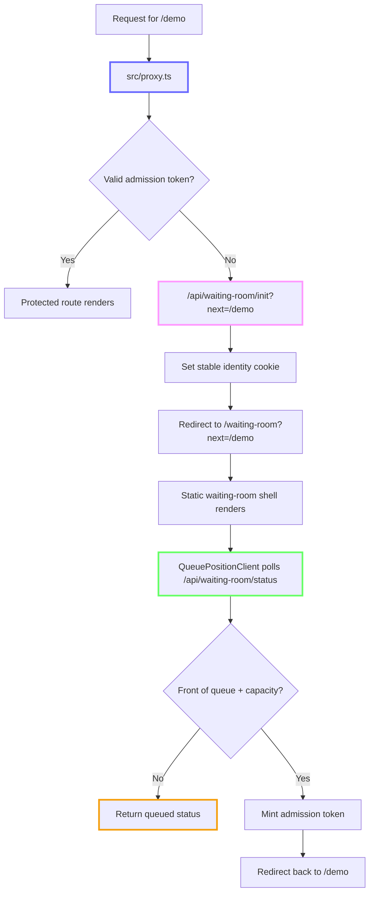

# nextjs-waiting-room

Deploy a waiting room in front of a Next.js route on Vercel. This repo shows how to keep the protected-route hot path cheap with signed admission tokens, use Redis only for queue transitions, and preserve the original destination through the full queue flow.

[](https://vercel.com/new/clone?repository-url=https%3A%2F%2Fgithub.com%2Fvercel%2Fnextjs-waiting-room)

## Features

- Provider-agnostic: Upstash Redis, self-hosted Redis (ioredis), or in-memory (dev)
- Signed admission token verified locally in `proxy.ts`
- FIFO queue with monotonic ticket ordering
- Atomic join-or-admit via Lua scripts (no thundering herd)
- Bounded Redis operations on hot paths
- Fail-open circuit breaker (site stays up if Redis is down)
- Next.js 16 proxy.ts (replaces middleware.ts)
- Session renewal via `waitUntil()` with infrequent Redis refresh
- Waiting-room shell that renders before queue status is fetched
- Adaptive client polling with jitter
- Namespaced Redis keys (multi-tenant safe)
- Preserves the original destination through the full queue flow

## Start Here

If you are reading this repo as a reference architecture, start with these files:

1. `src/proxy.ts` — verifies signed admission locally and only renews sessions occasionally
2. `src/lib/waiting-room/admission-token.ts` — HMAC-signed admission token minting and verification
3. `src/lib/waiting-room/service.ts` — the shared decision layer used by Proxy, routes, and pages
4. `src/app/api/waiting-room/init/route.ts` — mints the stable queue identity and redirects into the waiting room
5. `src/app/api/waiting-room/status/route.ts` — the queue transition endpoint that can admit and mint a token
6. `src/lib/waiting-room/providers/*.ts` — provider implementations and atomic Redis admission logic
7. `src/app/waiting-room/*` — the waiting room shell and adaptive polling client

## Request Lifecycle



## Why The Repo Is Structured This Way

- `src/proxy.ts` stays lean. The common admitted path is local token verification, not a Redis round-trip.
- `src/lib/waiting-room/admission-token.ts` isolates the stateless admission model from queue coordination concerns.
- `src/lib/waiting-room/service.ts` owns state transitions. Proxy, route handlers, and Server Components all reuse the same decisions instead of reimplementing queue logic in multiple places.
- `src/app/api/waiting-room/init/route.ts` is the single place that creates queue identity and clears stale admission state.
- `src/lib/waiting-room/providers/*.ts` hide backend differences behind one provider interface while keeping queue operations atomic.
- `src/app/waiting-room/*` is UI only. The shell renders quickly and the client adapts its polling cadence based on queue state.

## Quick Start

1. Clone the repository.
2. Install dependencies:

   ```bash
   pnpm install
   ```

3. Configure environment variables:

   ```bash
   cp .env.example .env.local
   ```

4. Start the development server:

   ```bash
   pnpm dev
   ```

5. Open <http://localhost:3000>.

## Core Runtime vs Demo Files

These files are the core waiting-room architecture you would copy into another app:

- `src/proxy.ts`
- `src/lib/waiting-room/admission-token.ts`
- `src/lib/waiting-room/types.ts`
- `src/lib/waiting-room/config.ts`
- `src/lib/waiting-room/edge-config.ts`
- `src/lib/waiting-room/cookies.ts`
- `src/lib/waiting-room/index.ts`
- `src/lib/waiting-room/service.ts`
- `src/lib/waiting-room/providers/*.ts`
- `src/lib/waiting-room/lua/try-admit.ts`
- `src/app/api/waiting-room/init/route.ts`
- `src/app/api/waiting-room/status/route.ts`

These files exist to make the demo easier to understand locally, but they are not required for a production waiting room:

- `src/lib/waiting-room/demo-simulation.ts`
- `src/app/api/waiting-room/stats/route.ts`
- `src/app/live-mode-panel.tsx`
- `src/app/demo-traffic-controls.tsx`
- `src/app/demo-mode-tabs.tsx`
- `src/app/(protected)/demo/page.tsx`
- `src/app/(protected)/purchase-button.tsx`
- `src/app/(protected)/session-footer.tsx`

## Configuration

### Environment Variables

| Variable | Description | Default |
| :--- | :--- | :--- |
| `WAITING_ROOM_PROVIDER` | Backend provider: "upstash", "ioredis", or "memory" | memory |
| `WAITING_ROOM_TOKEN_SECRET` | HMAC secret for signing admission tokens | required in production |
| `WAITING_ROOM_CAPACITY` | Max concurrent active users | 100 |
| `WAITING_ROOM_SESSION_TTL_SECONDS` | Active session duration (seconds) | 300 |
| `WAITING_ROOM_QUEUE_TTL_SECONDS` | Abandoned queue entry purge time (seconds) | 1800 |
| `WAITING_ROOM_NAMESPACE` | Redis key namespace | default |
| `WAITING_ROOM_FAIL_OPEN` | Allow traffic if Redis is unavailable | true |

### Dynamic Configuration with Vercel Edge Config

For production deployments on Vercel, you can use [Edge Config](https://vercel.com/docs/edge-config) to tune the waiting room **without redeploying**. Edge Config reads are served from memory on Vercel — zero latency cost.

**Setup:**

1. Create an Edge Config store in your [Vercel project settings](https://vercel.com/docs/edge-config/get-started).
2. The `EDGE_CONFIG` connection string is auto-injected by Vercel.
3. Add any of the keys below to your Edge Config store to override the corresponding env var:

| Edge Config Key | Type | Overrides |
| :--- | :--- | :--- |
| `waitingRoomCapacity` | number | `WAITING_ROOM_CAPACITY` |
| `waitingRoomSessionTtlSeconds` | number | `WAITING_ROOM_SESSION_TTL_SECONDS` |
| `waitingRoomQueueTtlSeconds` | number | `WAITING_ROOM_QUEUE_TTL_SECONDS` |
| `waitingRoomFailOpen` | boolean | `WAITING_ROOM_FAIL_OPEN` |

**Example Edge Config payload:**

```json
{
  "waitingRoomCapacity": 100,
  "waitingRoomSessionTtlSeconds": 300,
  "waitingRoomQueueTtlSeconds": 1800,
  "waitingRoomFailOpen": true
}
```

Only these flat top-level keys are read by the waiting room. Generic example
keys like `{"greeting":"hello world"}` are ignored by this app. You can store
just the keys you want to override; missing keys fall back to env vars and then
to the built-in defaults.

**Precedence:** Edge Config → env vars → hardcoded defaults.

**What stays in env vars only:** Secrets (`KV_REST_API_URL`, `KV_REST_API_TOKEN`, `UPSTASH_REDIS_REST_URL`, `UPSTASH_REDIS_REST_TOKEN`, `KV_URL`, `REDIS_URL`, `WAITING_ROOM_TOKEN_SECRET`) and deploy-time decisions (`WAITING_ROOM_PROVIDER`, `WAITING_ROOM_NAMESPACE`) are never read from Edge Config.

Edge Config is optional — the waiting room works identically with just env vars.

## Providers

### Upstash Redis

Recommended for serverless environments (Vercel).

- **Env Vars**: `KV_REST_API_URL`, `KV_REST_API_TOKEN` from the Vercel Marketplace / Vercel KV integration, or the legacy `UPSTASH_REDIS_REST_URL`, `UPSTASH_REDIS_REST_TOKEN`
- **Setup**: Set `WAITING_ROOM_PROVIDER=upstash`.

### IORedis

For self-hosted Redis instances.

- **Env Vars**: `REDIS_URL` or `KV_URL`
- **Setup**: Set `WAITING_ROOM_PROVIDER=ioredis`.

### Memory

For local development only.

- **Setup**: Set `WAITING_ROOM_PROVIDER=memory`. Throws an error in production.

## How It Works

- **`proxy.ts`**: Verifies signed admission tokens locally and only renews active sessions when they are nearing expiry.
- **Admission token**: Keeps the common admitted path stateless and cheap.
- **Lua Script**: Executes atomic join-or-admit operations in Redis, ensuring FIFO ordering and preventing race conditions.
- **Session tracking**: Uses expiry-scored sorted sets instead of scanning active-session hashes.
- **Queue heartbeat cleanup**: Drops stale queue entries lazily from the front so abandoned users do not permanently block admission.
- **Adaptive polling**: The client polls quickly near the front of the queue and more slowly when the user is far away.

## Production Reality Check

This repository is intentionally optimized for a cheap admitted path and
economical queue coordination. That means a few stronger guarantees are
deliberately out of scope in the current implementation.

- **Queue identity is continuity, not strong identity**: The stable waiting-room cookie is what preserves a user's place in line. That keeps the design simple and cheap, but it also means the queue identity behaves more like a bearer credential than a full auth session. A stronger design would bind queue identity to more server-side state or extra device signals, which adds more reads, writes, and operational complexity.
- **Fairness begins on first status contact**: The current flow does not allocate a Redis ticket during `/api/waiting-room/init`; the ticket is allocated on the first `/api/waiting-room/status` poll. That is cheaper because every redirected miss does not immediately become a Redis write, including bots, refresh churn, and users who bounce. The stricter alternative is closer to "arrival-time fairness," but it makes queue join cost scale with every protected-route miss.
- **Token renewal is optimistic**: Near expiry, `src/proxy.ts` refreshes the cookie immediately and renews Redis state in the background. That keeps admitted traffic fast, but it can temporarily oversubscribe capacity if the background renewal fails after the new token is minted. The stricter alternative is to block on renewal or re-check Redis more often, which pushes network cost and latency back into the hot path.
- **Fail-open is an availability choice, not a fairness choice**: The default behavior favors keeping the site reachable when Redis is unavailable. That is often the right tradeoff for a marketing launch, but it is the wrong default for hard inventory ceilings. A fail-closed posture is safer for scarce goods, but it also turns provider incidents into customer-visible lockouts.
- **Queue admission is not purchase authority**: This repo controls access to the protected page. It does not create an inventory hold, serialize checkout, or make downstream writes idempotent. If the protected experience sells scarce inventory, you still need separate reservation, idempotency, and anti-bot controls after admission.

The deeper tradeoff analysis in [`docs/waiting-room-scale-architecture.md`](./docs/waiting-room-scale-architecture.md) explains why these lighter guarantees can be much cheaper at launch scale than the stricter alternatives.

## Production Guardrails

The waiting room should be one layer in a larger launch posture, not the only
line of defense.

- **Filter abuse before the queue pays for it**: Put [Vercel Firewall](https://vercel.com/docs/security/vercel-firewall) in front of the waiting room and enable the managed protections that fit your traffic profile.
- **Treat queue churn as suspicious traffic**: Add Firewall rules for `src/proxy.ts`'s protected paths plus `/api/waiting-room/init` and `/api/waiting-room/status`. Prefer `challenge` or `rate_limit` actions for suspicious retries so bots do not turn queue polling into an application cost amplifier.
- **Use BotID on protected mutations, not as a queue replacement**: Keep `proxy.ts` as the GET-side gate, then add [BotID](https://vercel.com/docs/botid/get-started) to expensive POST routes or Server Actions after admission, such as checkout, reservation, or promo-claim flows.
- **Keep an incident switch ready**: Use Edge Config for capacity and fail-open tuning, and keep [Attack Challenge Mode](https://vercel.com/docs/rest-api/security/update-attack-challenge-mode) as an emergency control for active launch abuse.
- **Make trusted traffic explicit**: Internal webhooks, staff tools, synthetic monitoring, and operational IP ranges should bypass the queue intentionally rather than competing with real users.

The deeper architecture notes in [`docs/waiting-room-scale-architecture.md`](./docs/waiting-room-scale-architecture.md) include a route-by-route recommendation for how these layers fit together.

## Project Structure

```plaintext
src/
├── proxy.ts                              # Protects the demo route
├── app/
│   ├── api/waiting-room/init/route.ts    # Mints queue identity and redirects into the waiting room
│   ├── api/waiting-room/status/route.ts  # Polling endpoint for queued browsers
│   ├── api/waiting-room/stats/route.ts   # Demo-only landing page stats
│   ├── waiting-room/                     # Waiting room page and polling client
│   └── (protected)/demo/page.tsx         # Example protected route behind the waiting room
└── lib/waiting-room/
    ├── config.ts                         # Runtime config loading and caching
    ├── cookies.ts                        # Cookie contracts and redirect helpers
    ├── demo-simulation.ts                # Demo-only queue pressure helpers
    ├── edge-config.ts                    # Edge Config overrides for runtime knobs
    ├── index.ts                          # Provider selection and lazy construction
    ├── service.ts                        # Shared waiting room state machine
    ├── types.ts                          # Status unions, provider interfaces, config types
    ├── lua/try-admit.ts                  # Atomic Redis admission script
    └── providers/                        # Upstash, IORedis, and memory providers
```

## Deployment

- **Vercel**: Use the Upstash Redis provider for seamless integration.
- **Self-hosted**: Use the IORedis provider with your own Redis instance.
